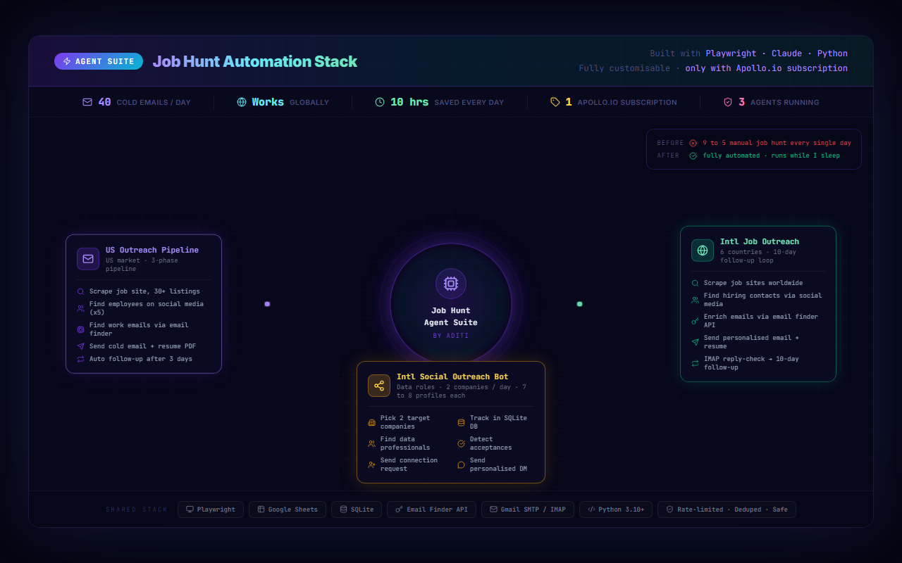

# Job Hunt Automation Stack

> 3 AI agents. 40 cold emails a day. Built because the job market left me no choice.

---

## Why I built this

I have been job hunting for months in one of the toughest markets for tech roles I have ever seen.

Every day looked the same: open job boards, find listings, research the company, find the right person to reach out to, write a personalised email, send it, follow up days later, and repeat this for every single application. That is a full-time job on top of actually being a job seeker.

At some point I asked myself: I am a software engineer. I build automation systems for products. Why am I not doing this for myself?

So I stopped applying manually and started building.

---

## What this is

A personal job hunt automation stack made up of 3 independent AI agents that run daily and handle the repetitive parts of outreach so I can focus on the conversations that actually matter.

This is not a product. It is not a startup. It is an engineer solving her own problem with the tools she knows best.

---

## The 3 Agents

### Agent 1: US Outreach Pipeline

[github.com/aditi-py/us-job-outreach-pipeline](https://github.com/aditi-py/us-job-outreach-pipeline)

Targets US-based roles via job sites. Runs as a 3-phase pipeline every morning:

- Scrapes 30+ fresh job listings from a job site
- Finds up to 5 relevant employees at each company via social media
- Finds their work emails via an email finder tool
- Sends a personalised cold email with my resume attached
- Automatically follows up after 3 days if there is no reply

### Agent 2: International Job Outreach Pipeline

[github.com/aditi-py/international-job-outreach-pipeline](https://github.com/aditi-py/international-job-outreach-pipeline)

Built for global reach across 6 countries. It:

- Scrapes job listings worldwide from social media and job platforms
- Finds hiring contacts via social media profiles
- Enriches contact data using an email finder API
- Sends personalised outreach with my resume
- Runs a 10-day follow-up loop over IMAP, checking for replies at each step

### Agent 3: International Social Outreach Bot

[github.com/aditi-py/linkedin-international-outreach-bot](https://github.com/aditi-py/linkedin-international-outreach-bot)

Focuses on building connections rather than cold email. It:

- Picks 2 target companies per day
- Finds 7 to 8 data professionals at each company
- Sends personalised connection requests
- Tracks everything in a local SQLite database
- Detects when a connection is accepted
- Sends a personalised DM immediately after acceptance

---

## The Numbers

| Metric | Value |
|---|---|
| Cold emails sent per day | ~40 |
| Countries covered | 6+ |
| Hours saved per day | ~10 |
| Paid subscriptions needed | Only Apollo.io |
| Agents running | 3 |

---

## Tech Stack

| Tool | Role |
|---|---|
| Python 3.10+ | Core language for all agents |
| Playwright | Browser automation for scraping and social media |
| Gmail SMTP / IMAP | Sending emails and checking replies |
| SQLite | Tracking outreach, deduplication, follow-up state |
| Google Sheets | Logging and review dashboard |
| Email Finder API | Contact enrichment for the international agent |

All agents are rate-limited and deduplicated to stay safe and respectful of platform limits.

---

## What I have learned

- Cold outreach still works if it is personalised and consistent
- The bottleneck was never the writing, it was the volume and the follow-up
- Automating the grunt work does not remove the human element, it protects your energy for the parts that need it
- Engineering skills are not just for your job, they are for your life

---

## Code availability

The actual code for each agent lives in the linked repos above.

If you are a recruiter, hiring manager, or fellow engineer who wants to talk through the implementation, feel free to reach out directly.

You can find me on [LinkedIn](https://www.linkedin.com/in/aditi-py) or open a GitHub issue here.

---

## License

This project was built with AI assistance. The system architecture, design decisions, documentation, and overall structure reflect original human creative work and are shared for portfolio purposes only. Please do not replicate or redistribute without permission.
---

*Built by Aditi | Python, Playwright, Claude, Gmail API*
